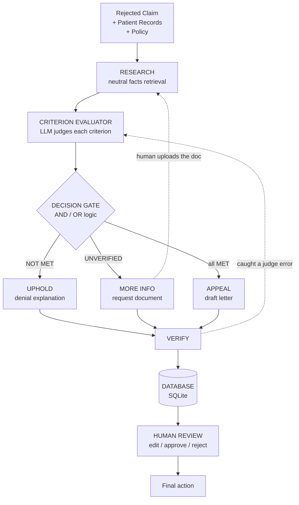

# Insurance Claim Analysis Agent

An **agentic AI** that reads a rejected health-insurance claim plus the patient's
records and **honestly** decides whether to **appeal**, **uphold** the denial, or
**request more information** — then lets a **human make the final decision**.

> **Product principle: the AI prepares; the human decides.**

---

## The problem

Insurance claim denials are a multi-billion-dollar administrative burden. Most
tools make one of two mistakes:

1. **Blind advocacy** — they always argue *for* the patient, even when the denial is correct.
2. **Opaque output** — they give an answer with no evidence trail.

This project fixes both: it is **honest** (it can say "the denial is correct") and
**explainable** (every statement is backed by a cited source).

---

## Architecture



### The honest triage — three states, not two

| State | Meaning | What it triggers |
|---|---|---|
| ✅ **MET** | Evidence is present and positive | counts as satisfied |
| ❌ **NOT MET** | Evidence of absence (e.g. *"patient declined therapy"*) | denial is substantively **correct** |
| ⚠️ **UNVERIFIED** | Absence of evidence (record says nothing) | **request the missing document** — not "fail", not "pass" |

> Key insight: **"no evidence found" ≠ "criterion not satisfied."**
> UNVERIFIED usually maps to a *"documentation insufficient"* denial, which is
> often **winnable** by supplying the missing note.

### Decision gate — AND / OR logic (three-valued)

Criteria are extracted as a boolean expression (e.g. `A AND B AND C` or
`(A AND B) OR C`) and evaluated with **three-valued logic**:

```
expression → True   → APPEAL
expression → False  → UPHOLD
expression → Unknown→ MORE INFO
```

This naturally handles alternative criteria. Example: if the policy is
`(A AND B) OR C`, then failing A but meeting C still routes to **APPEAL** —
a naive "any NOT MET → uphold" rule would wrongly give up.

### Two safety mechanisms

1. **Anti-hallucination guard (code):** every citation in the output must exist
   in the retrieved evidence — otherwise the output is forced to FAIL.
2. **Double-check the judge (LLM):** VERIFY re-reads each criterion and confirms
   (or corrects) the evaluator's MET / NOT MET / UNVERIFIED call. A caught judge
   error loops back to the evaluator once.

---

## Data flow (one claim through the system)

```
rejected claim + records + policy
        │
        ▼
  RESEARCH         retrieve relevant FACTS neutrally (not "help the patient")
        │
        ▼
  EVALUATOR        LLM reads facts → each criterion = MET / NOT MET / UNVERIFIED
        │
        ▼
  DECISION GATE    three-valued AND/OR expression
        │
   ┌────┼────────┐
   ▼    ▼        ▼
 APPEAL UPHOLD  MORE INFO
   │    │        │
 DRAFT EXPLAIN  REQUEST
   │    │        │
   └────┼────────┘
        ▼
  VERIFY          ground output + double-check the judge
        │
        ▼
  DATABASE        save as "pending approval"
        │
        ▼
  HUMAN REVIEW    edit → approve / reject
```

---

## Key design decisions

| # | Decision | Rationale |
|---|---|---|
| 1 | **Criterion Evaluator is an LLM** | distinguishing ❌ *"declined"* from ⚠️ *"not mentioned"* needs reading, not keyword match |
| 2 | **Research retrieves neutrally** | if it only searches "for the patient", the ❌ NOT MET path is unreachable → the system can never be honest |
| 3 | **AND / OR boolean gate** | policies use `(A AND B) OR C`; a flat "any NOT MET" rule would give wrong answers |
| 4 | **VERIFY is generalized** | it checks *whatever* the path produced (letter / explanation / request) |
| 5 | **Double-check the judge** | the most important decision (MET/NOT MET/UNVERIFIED) is re-validated, not trusted blindly |
| 6 | **Re-upload loop** | UNVERIFIED → request doc → human uploads → re-run |

---

## Tech stack

| Layer | Choice |
|---|---|
| Language | Python 3.10+ |
| Agent orchestration | LangGraph |
| LLM | DeepSeek via **our own urllib client** (no heavy SDK); also OpenAI/Anthropic/Google/Ollama/mock |
| Retrieval | **Hybrid: BM25 + semantic embeddings**, fused by reciprocal rank fusion (RRF) |
| Embeddings | `sentence-transformers` (`all-MiniLM-L6-v2`) — real semantic, downloads once |
| UI | Streamlit |
| Persistence | SQLite (stdlib) |
| Validation | Pydantic (structured outputs) |

---

## Project structure

```
priorauth-crusher/
├── app.py                    # Streamlit UI (Analyze + Admin)
├── requirements.txt
├── .env.example              # copy to .env and add your key
├── src/
│   ├── config.py             # provider, models, caps, db path, HF cache
│   ├── llm.py                # provider factory + DeepSeek urllib client
│   ├── state.py              # GraphState + pydantic schemas
│   ├── graph.py              # LangGraph wiring (gate + loop)
│   ├── logic.py              # three-valued AND/OR evaluator
│   ├── store.py              # SQLite (save / list / approve / reject)
│   ├── audit.py              # audit-trail recorder
│   ├── agents/
│   │   ├── research.py       # neutral facts + criteria extraction
│   │   ├── evaluator.py      # LLM judge: MET / NOT MET / UNVERIFIED
│   │   ├── draft.py          # APPEAL path (letter)
│   │   ├── uphold.py         # UPHOLD path (denial explanation)
│   │   ├── request.py        # MORE INFO path (document request)
│   │   └── verify.py         # grounding + double-check the judge
│   ├── retrieval/
│   │   ├── bm25_index.py     # BM25 + stopwords + synonyms
│   │   ├── embedder.py       # sentence-transformers (semantic)
│   │   ├── hybrid.py         # cosine + reciprocal rank fusion
│   │   └── policy_store.py   # hybrid retriever
│   └── tools/search_tools.py
├── data/
│   ├── policy/               # coverage rule documents
│   └── synthetic/            # sample denials + patient records (appeal/uphold/more_info)
└── scripts/
    ├── run_pipeline.py       # CLI runner (appeal | uphold | more_info)
    ├── download_model.py     # download the semantic model + sanity check
    ├── test_hybrid.py        # 5-level retrieval test
    ├── test_providers.py     # provider routing checks
    └── retrieval_*.py        # Phase-1 de-risking tests
```

---

## Run it

### 0. One-time: download the semantic model

```bash
python scripts/download_model.py
```

(The first `Analyze` run also downloads it automatically.)

### 1. Mock mode (no API key)

```bash
cp .env.example .env          # set LLM_PROVIDER=mock
streamlit run app.py
```

Or CLI — run all three triage paths:

```bash
LLM_PROVIDER=mock python scripts/run_pipeline.py appeal
LLM_PROVIDER=mock python scripts/run_pipeline.py uphold
LLM_PROVIDER=mock python scripts/run_pipeline.py more_info
```

### 2. Real DeepSeek

```bash
# .env
LLM_PROVIDER=deepseek
DEEPSEEK_API_KEY=sk-...       # your key
```

Then `streamlit run app.py`.

---

## Current status

**Implemented (working, verified):**
- ✅ Honest triage — three states + three paths (appeal / uphold / more info)
- ✅ AND / OR boolean gate (three-valued logic)
- ✅ Double-check the judge + anti-hallucination guard
- ✅ **Hybrid search** — BM25 + real semantic embeddings (RRF fusion)
- ✅ DeepSeek client via `urllib` (no `langchain-openai` needed)
- ✅ Async approval workflow (AI saves → human approves)
- ✅ Streamlit UI (Analyze + Admin)
- ✅ Mock mode + provider routing checks

**Remaining (nice-to-haves):**
- ⏳ Run with a real DeepSeek key
- ⏳ Formal pytest eval suite (faithfulness / grounding / precision)
- ⏳ Re-upload cycle limit tracking (round counter in DB)
- ⏳ OCR for scanned/image PDFs

---

## Retrieval — why hybrid, not just BM25

Raw BM25 (exact words) **fails on paraphrase** — it matched words, not meaning.
The hybrid (BM25 + semantic embeddings) fixes this.

| Mode | Level 1–4 (top-1 correct) |
|---|---|
| raw BM25 | 9/11 |
| BM25 + synonyms | 11/11 |
| **Hybrid (BM25 + embeddings)** | **10/11** (with true semantic matching; the one "miss" is a query phrased as a patient description, which correctly matches a patient record — in the real pipeline policies and records are searched separately) |

Semantic proof — meaning, not characters:

| Pair | Similarity |
|---|---|
| "knee pain" vs "chronic ache in the joint below the thigh" | 0.619 |
| "knee pain" vs "continuous glucose monitor" | -0.058 |
| "sugar monitoring device" vs "continuous glucose monitor" | **0.689** |
