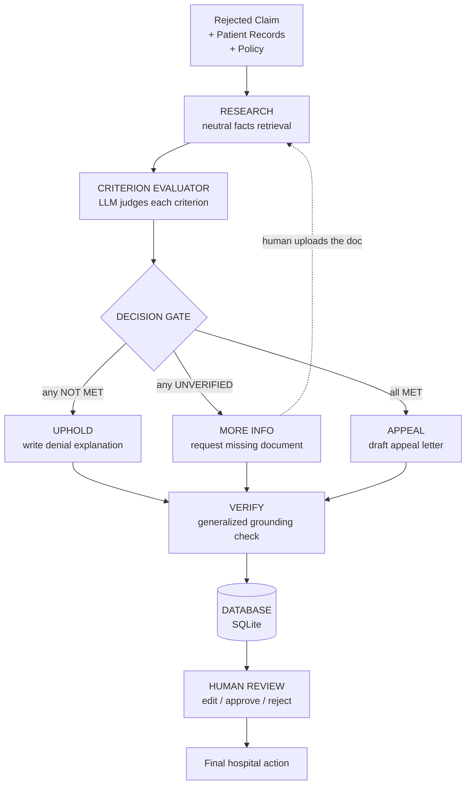

# Insurance Claim Analysis Agent

An **agentic AI** that reads a rejected health-insurance claim plus the patient's
records and **honestly** decides whether to **appeal**, **uphold** the denial, or
**request more information** — then lets a **human make the final decision**.

> **Product principle: the AI prepares; the human decides.**

---

## The problem

Insurance claim denials are a multi-billion-dollar administrative burden. Most
tools make one of two mistakes:

1. **Blind advocacy** — they always argue *for* the patient, even when the denial is correct.
2. **Opaque output** — they give an answer with no evidence trail.

This project fixes both: it is **honest** (it can say "the denial is correct") and
**explainable** (every statement is backed by a cited source).

---

## Architecture (target design)



### The honest triage — three states, not two

| State | Meaning | What it triggers |
|---|---|---|
| ✅ **MET** | Evidence is present and positive | counts as satisfied |
| ❌ **NOT MET** | Evidence of absence (e.g. *"patient declined therapy"*) | denial is substantively **correct** |
| ⚠️ **UNVERIFIED** | Absence of evidence (record says nothing) | **request the missing document** — not "fail", not "pass" |

> Key insight: **"no evidence found" ≠ "criterion not satisfied."**
> UNVERIFIED usually maps to a *"documentation insufficient"* denial, which is
> often **winnable** by supplying the missing note.

### Decision gate (deterministic priority)

```
any criterion ❌ NOT MET     → UPHOLD
else any ⚠️ UNVERIFIED       → REQUEST DOCUMENT
else (all ✅ MET)            → APPEAL
```

> Future refinement: criteria can be `AND`/`OR` (e.g. `(A AND B) OR C`), so the
> gate should eventually understand mandatory vs. optional vs. alternative criteria
> instead of a universal "any NOT MET".

---

## Data flow (one claim through the system)

```
rejected claim + records + policy
        │
        ▼
  RESEARCH         retrieve relevant FACTS neutrally (not "help the patient")
        │
        ▼
  EVALUATOR        LLM reads facts → each criterion = MET / NOT MET / UNVERIFIED
        │
        ▼
  DECISION GATE    route by priority
        │
   ┌────┼────────┐
   ▼    ▼        ▼
 APPEAL UPHOLD  MORE INFO
   │    │        │
 DRAFT EXPLAIN  REQUEST
   │    │        │
   └────┼────────┘
        ▼
  VERIFY          ground every output against real evidence (anti-hallucination)
        │
        ▼
  DATABASE        save as "pending approval"
        │
        ▼
  HUMAN REVIEW    edit → approve / reject
```

---

## Key design decisions

| # | Decision | Rationale |
|---|---|---|
| 1 | **Criterion Evaluator is an LLM** | distinguishing ❌ *"declined"* from ⚠️ *"not mentioned"* needs reading, not keyword match |
| 2 | **Research retrieves neutrally** | if it only searches "for the patient", the ❌ NOT MET path is unreachable → the system can never be honest |
| 3 | **Deterministic priority gate** | `NOT MET > UNVERIFIED > MET` |
| 4 | **VERIFY is generalized** | it checks *whatever* the path produced (letter / explanation / document request), not just the letter |
| 5 | **Re-upload loop** | UNVERIFIED → request doc → human uploads → re-run, with a cycle limit to prevent infinite loops |

---

## Tech stack

| Layer | Choice |
|---|---|
| Language | Python 3.10+ |
| Agent orchestration | LangGraph |
| LLM | DeepSeek via **our own urllib client** (no heavy SDK); also supports OpenAI/Anthropic/Google/Ollama/mock |
| Retrieval | BM25 + stopwords + synonyms (pure Python, no install) |
| Embeddings | optional (`sentence-transformers`), graceful fallback to BM25 |
| UI | Streamlit |
| Persistence | SQLite (stdlib) |
| Validation | Pydantic (structured outputs) |

---

## Project structure

```
priorauth-crusher/
├── app.py                    # Streamlit UI (Run + Admin)
├── requirements.txt
├── .env.example              # copy to .env and add your key
├── src/
│   ├── config.py             # provider, models, caps, db path
│   ├── llm.py                # provider factory + DeepSeek urllib client
│   ├── state.py              # GraphState + pydantic schemas
│   ├── graph.py              # LangGraph wiring
│   ├── store.py              # SQLite (save / list / approve / reject)
│   ├── audit.py              # audit-trail recorder
│   ├── agents/
│   │   ├── research.py       # plan + retrieve (+ sufficiency re-query)
│   │   ├── draft.py          # write appeal letter
│   │   └── verify.py         # grade + anti-hallucination guard
│   ├── retrieval/
│   │   ├── bm25_index.py     # BM25 + stopwords + synonyms
│   │   ├── policy_store.py   # load/chunk docs + hybrid retriever
│   │   └── embedder.py       # optional embeddings (graceful fallback)
│   └── tools/search_tools.py
├── data/
│   ├── policy/               # coverage rule documents
│   └── synthetic/            # sample denials + patient records
└── scripts/
    ├── run_pipeline.py       # CLI runner
    ├── test_providers.py     # provider routing checks
    └── retrieval_*.py        # Phase-1 de-risking tests
```

---

## Run it

### 1. Mock mode (no API key — fastest)

```bash
cp .env.example .env          # then set LLM_PROVIDER=mock in .env
streamlit run app.py
```

Or CLI:

```bash
LLM_PROVIDER=mock python scripts/run_pipeline.py
```

### 2. Real DeepSeek

```bash
# .env
LLM_PROVIDER=deepseek
DEEPSEEK_API_KEY=sk-...       # your key
```

Then `streamlit run app.py`.

---

## Current status

**Implemented (working, verified):**
- ✅ Retrieval with BM25 + stopwords + synonyms — **11/11** on the 5-level test
- ✅ 3-agent pipeline (research → draft → verify) with re-query loop
- ✅ Anti-hallucination guard (letter can't cite evidence it never found)
- ✅ DeepSeek client via `urllib` (no `langchain-openai` needed)
- ✅ Async approval workflow (AI saves → human approves; no `interrupt()`)
- ✅ Streamlit UI (Run + Admin)
- ✅ Provider architecture checks (mock / deepseek / openai)

**Next (the target architecture above):**
- ⏳ Neutral `RESEARCH` + `CRITERION EVALUATOR` (LLM) node
- ⏳ `UPHOLD` path (denial explanation) and `MORE INFO` path (document request)
- ⏳ Generalized `VERIFY` (checks all three outputs)
- ⏳ Re-upload loop with cycle limit

---

## Retrieval de-risking (why BM25 + synonyms, not just BM25)

A 5-level difficulty test showed raw BM25 **fails on paraphrase** (different words,
same meaning). Adding stopword removal + a small synonym map lifted it to **11/11**.

| Mode | Level 1–4 (top-1 correct) |
|---|---|
| raw BM25 | 9/11 |
| + stopwords | 9/11 |
| + stopwords + synonyms | **11/11** |

True embeddings are an optional upgrade for unseen wording; they are **not**
required to validate the idea.
